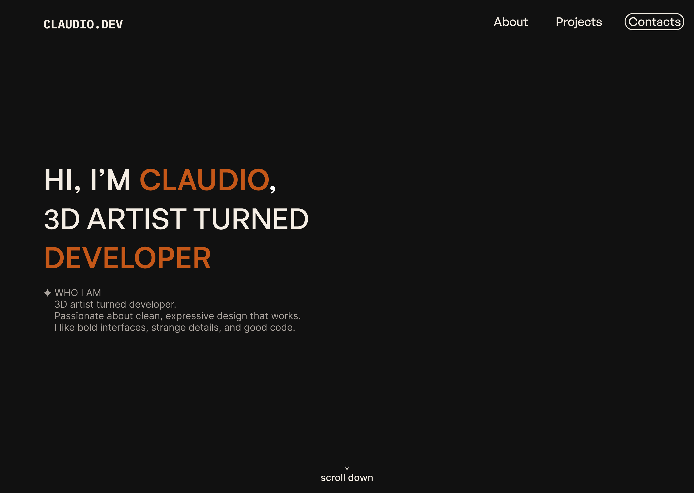

# claudio.dev

My personal portfolio — designed, coded, and deployed from scratch.  
A clean, responsive site to showcase my journey from **3D artist** to **front-end developer**.

**[Live Demo](https://complex89.github.io/claudioportfolio-site/)**

---

## Figma Design Reference

This is the original Figma design I created before building the site in HTML/CSS.

---

## What’s inside

- Fully responsive layout for desktop and mobile
- Accessible navigation for better usability
- CSS custom properties for colors, spacing, and type scale
- Built entirely with plain HTML and CSS — no frameworks

## Tech I used

- HTML5
- CSS3 (Flexbox, custom properties)
- Fonts from [Fontshare](https://www.fontshare.com/)

## Why I built it

I wanted something I could look back on and say: _that’s where I started_.  
Something to keep me consistent and motivated to improve every day.  
It’s also a base I can keep improving as I learn more about JS, animation, and accessibility.
